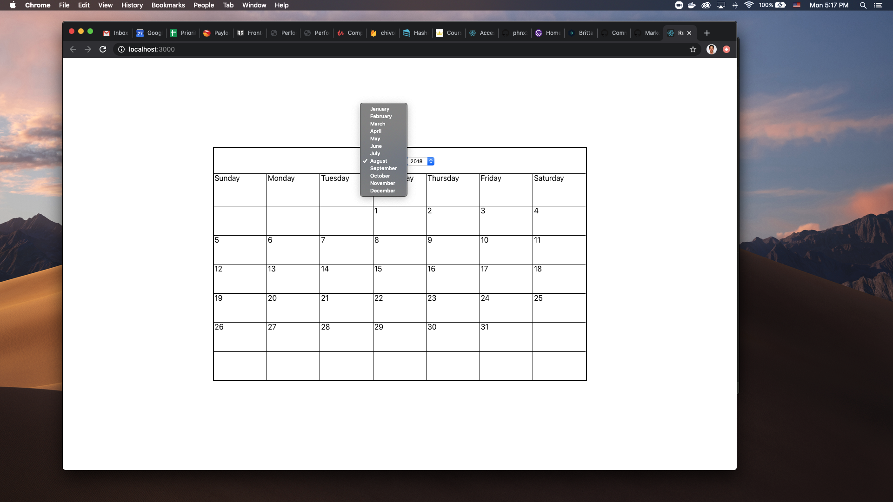
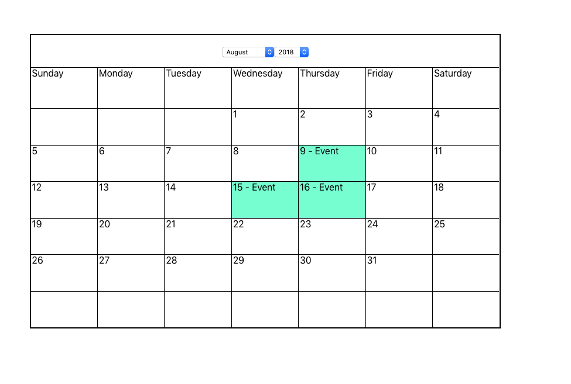

<<<<<<< HEAD
## Prompt Calendar
=======
This calendar was created using React. It renders the dates dynamically depending on the month and year selected from the dropdown. Clicking on a cell will create an event for that date and click will untoggle the event that is held in the Cell's state. 

There are still quite some todo's left that I could not get to because of time but can implement in the future:

• event editing
• time slots for events
• drag and drop

Make sure that you have the latest version of node installed on your machine , use 
`git clone https://github.com/phnx311/prompt-calendar.git`
then in the project directory, you can run:
>>>>>>> efdaf16b118578547bdbd7438b85ca5700802c0c

The purpose of this project was to mimic the functionality of Google Calendar.

### The calendar should:
* render an accurate calendar depending on the month and year selected

* Allow for the creation of Events and access to a event modal to fill in metadata about the event

### To Do

* Add Styling and customization options
* Create Modal for Event Creation
* Allow drag and drop capability for Events
* Implement Redux to hold global state

### `npm start`
Runs the app in the development mode. 
Open [http://localhost:3000](http://localhost:3000) to view it in the browser.

